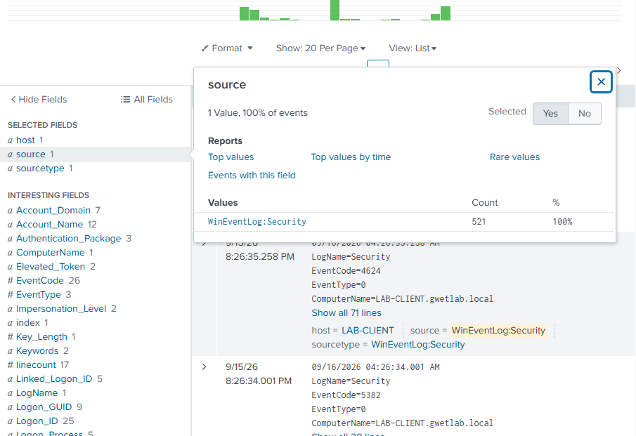
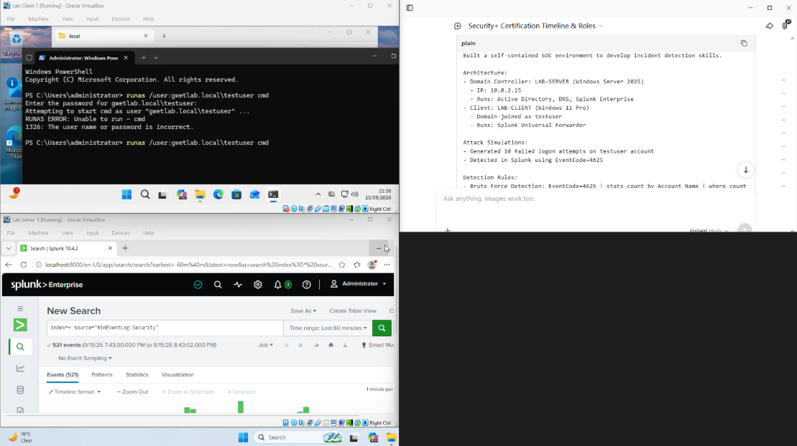
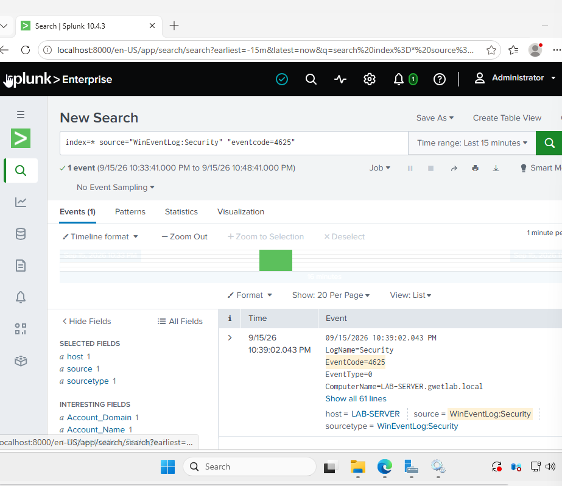
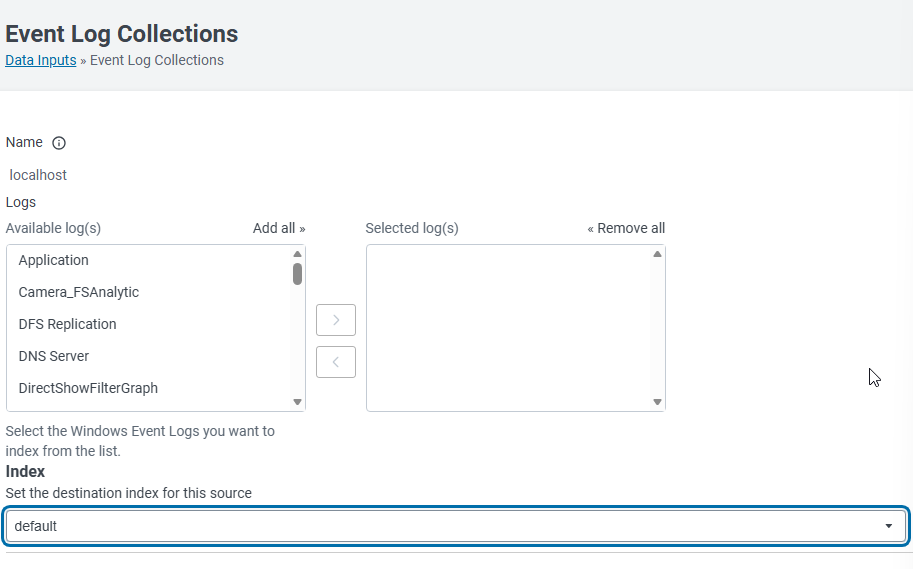
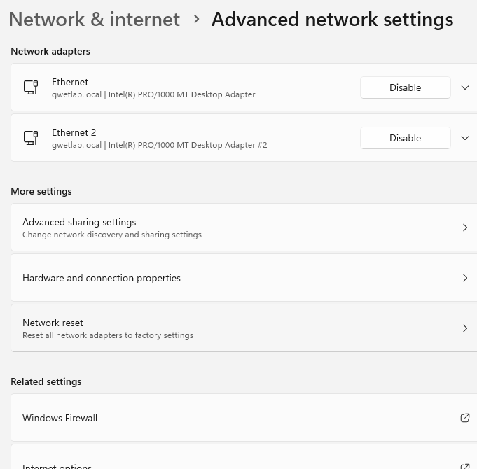
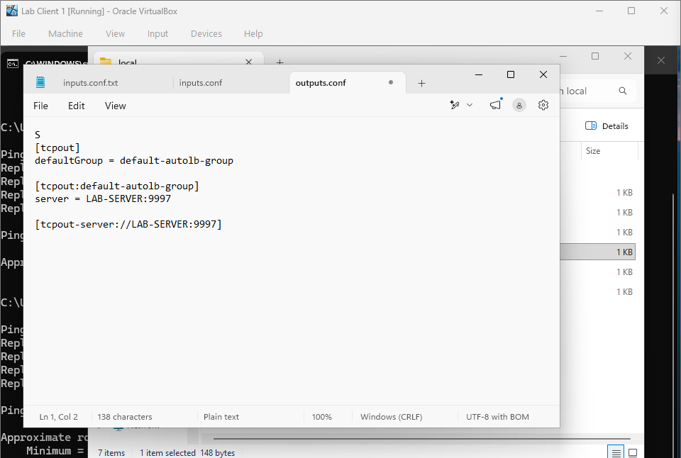
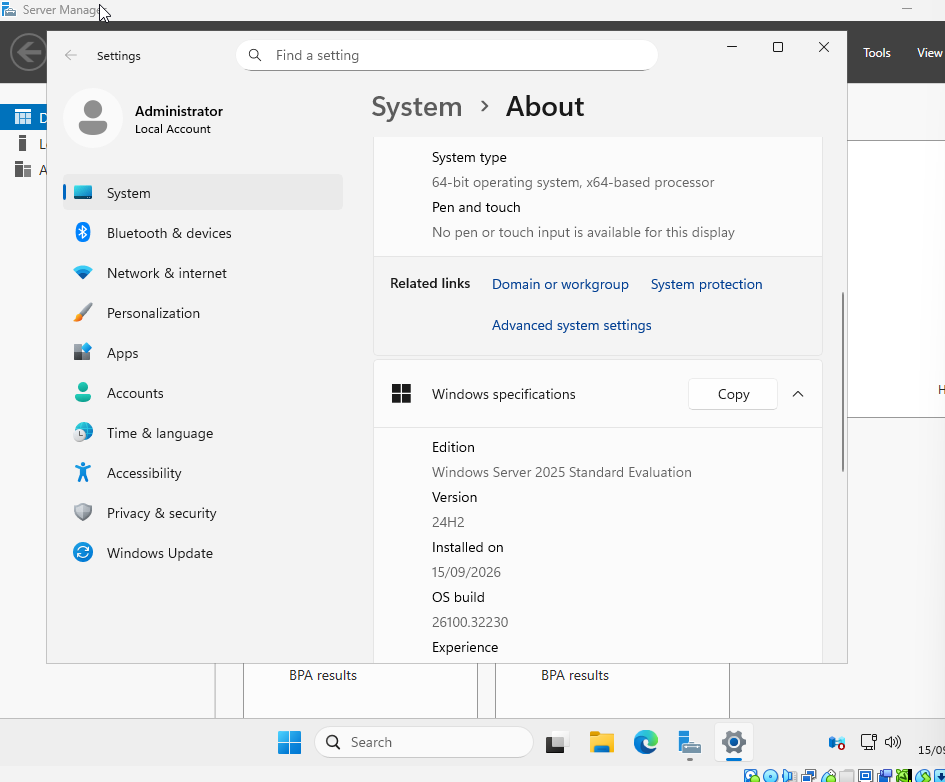
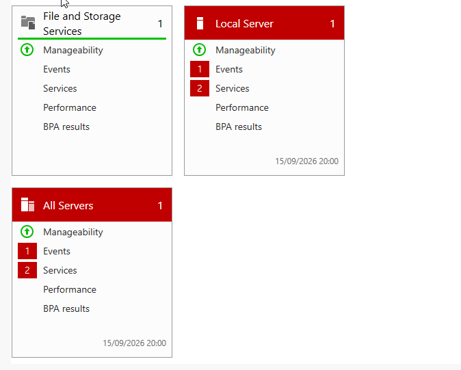

# Active Directory Security Monitoring Lab

> A self-contained SOC environment built to develop incident detection and response capabilities. This lab simulates a real-world enterprise network with a Windows domain controller, domain-joined endpoint, and a Splunk SIEM for centralized log ingestion and threat detection.

---

## Table of Contents

- [Overview](#overview)
- [Architecture](#architecture)
- [Technologies Used](#technologies-used)
- [Lab Setup](#lab-setup)
- [Attack Simulations](#attack-simulations)
- [Detection Rules](#detection-rules)
- [Screenshots](#screenshots)
- [Skills Demonstrated](#skills-demonstrated)
- [Future Improvements](#future-improvements)
- [Certifications](#certifications)

---

## Overview

This project was built to bridge the gap between general IT support and dedicated security operations. The lab replicates the core components of a Security Operations Centre (SOC) infrastructure:

- **Domain Controller:** Windows Server 2025 running Active Directory, DNS, and Group Policy
- **Client Endpoint:** Windows 11 Pro domain-joined workstation
- **SIEM Platform:** Splunk Enterprise receiving and indexing Windows event logs
- **Log Forwarder:** Splunk Universal Forwarder shipping Security, System, and Application logs

The environment was used to simulate real-world attack scenarios and develop Splunk detection queries for anomalous authentication patterns and privilege escalation attempts.

---

## Architecture

```javascript
┌─────────────────────────────────────────────────────────────┐
│                        HOST MACHINE                          │
│                   (VirtualBox Hypervisor)                    │
└─────────────────────────────────────────────────────────────┘
                              │
          ┌───────────────────┴───────────────────┐
          │                                       │
┌─────────▼──────────┐                  ┌─────────▼──────────┐
│   LAB-SERVER       │                  │   LAB-CLIENT       │
│   (Domain Ctrl)    │◄────Host-Only───►│   (Workstation)    │
│                    │      Network     │                    │
├────────────────────┤                  ├────────────────────┤
│ • Windows Server   │                  │ • Windows 11 Pro   │
│   2025             │                  │ • Domain Joined    │
│ • Active Directory │                  │ • Splunk UF        │
│ • DNS              │                  │                    │
│ • Splunk Ent.      │                  │                    │
│   (Port 8000/9997) │                  │                    │
└────────────────────┘                  └────────────────────┘
         ▲                                        │
         │         Splunk Data Ingestion          │
         └────────────────────────────────────────┘
```

### Network Configuration

| VM | Adapter 1 (NAT) | Adapter 2 (Host-Only) | Purpose |
| --- | --- | --- | --- |
| LAB-SERVER | Internet access | 192.168.56.x | Domain + Splunk |
| LAB-CLIENT | Internet access | 192.168.56.x | Domain member |

---

## Technologies Used

| Category | Technology | Purpose |
| --- | --- | --- |
| Virtualisation | Oracle VirtualBox | Hypervisor for lab environment |
| Server OS | Windows Server 2025 Standard (Desktop Experience) | Domain Controller |
| Client OS | Windows 11 Pro | Domain-joined workstation |
| Directory Services | Active Directory Domain Services | Identity & access management |
| DNS | Windows DNS Server | Domain name resolution |
| SIEM | Splunk Enterprise (Free License) | Log aggregation & analysis |
| Log Forwarder | Splunk Universal Forwarder | Windows event log shipping |
| Policy | Group Policy Objects | Security baseline configuration |

---

## Lab Setup

### 1. Domain Controller Deployment (LAB-SERVER)

- Installed Windows Server 2025 with Desktop Experience
- Promoted to Domain Controller for `gwetlab.local` forest
- Configured DNS forwarding for domain resolution
- Created Organisational Units: `IT`, `Teachers`, `Students`
- Created security group: `IT_Admins`
- Created test user: `testuser` (member of `IT_Admins`)

### 2. Splunk Enterprise Installation

- Installed Splunk Enterprise on LAB-SERVER
- Configured receiving port **9997** for Universal Forwarder data
- Configured web interface port **8000** for Splunk Web access
- Enabled local Windows Event Log collection (Security, System, Application)

### 3. Client Deployment (LAB-CLIENT)

- Installed Windows 11 Pro (bypassed TPM/Secure Boot checks for VM compatibility)
- Joined to `gwetlab.local` domain
- Configured DNS to point to LAB-SERVER for domain resolution
- Installed Splunk Universal Forwarder
- Configured `inputs.conf` to forward:
- `WinEventLog://Security`
- `WinEventLog://System`
- `WinEventLog://Application`

### 4. Verification

- Confirmed 521 Security events ingested into Splunk within first hour
- Verified `host=LAB-CLIENT` field populated correctly in Splunk
- Confirmed EventCode 4728 (privilege escalation) detection capability

---

## Attack Simulations

### Simulation 1: Privilege Escalation (Group Membership Change)

**Objective:** Detect unauthorised additions to privileged Active Directory groups.

**Method:**

1. Opened Active Directory Users and Computers on LAB-SERVER
2. Navigated to `gwetlab.local > IT > IT_Admins`
3. Added `testuser` to the `IT_Admins` security group

**Expected Detection:** EventCode 4728 — *"A member was added to a security-enabled global group"*

---

### Simulation 2: Failed Authentication Attempts

**Objective:** Detect brute-force or password-spray attacks against domain accounts.

**Method:**

1. Enabled "Audit Logon Events > Failure" via Local Security Policy
2. Locked LAB-CLIENT workstation (Win + L)
3. Attempted 10 failed logins as `gwetlab.local\testuser` with incorrect passwords

**Expected Detection:** EventCode 4625 — *"An account failed to log on"*

---

## Detection Rules

### Rule 1: Privileged Group Modification

**Description:** Alert when a user is added to a security-enabled group (e.g., Domain Admins, IT_Admins).

**Splunk SPL:**

```spl
index=* source="WinEventLog:Security" EventCode=4728
| table _time, Account_Name, MemberName, ComputerName
| eval Risk="HIGH"
```

**MITRE ATT&CK Mapping:** T1098 — Account Manipulation

---

### Rule 2: Brute Force Detection

**Description:** Detect multiple failed logon attempts for the same account within a short timeframe.

**Splunk SPL:**

```spl
index=* source="WinEventLog:Security" EventCode=4625
| stats count by Account_Name, ComputerName
| where count > 5
| eval Alert="Potential Brute Force"
```

**MITRE ATT&CK Mapping:** T1110 — Brute Force

---

### Rule 3: Event Volume Baseline

**Description:** Monitor overall security event volume from domain endpoints.

**Splunk SPL:**

```spl
index=* host=LAB-CLIENT
| timechart span=1h count by source
```

---

## Screenshots


*521 Security events ingested from LAB-CLIENT within the first hour of forwarder deployment*


*End-to-end workflow: attack simulation on LAB-CLIENT (top) and corresponding Splunk ingestion on LAB-SERVER (bottom)*


*EventCode 4625 (failed logon) detected on LAB-SERVER, validating the brute-force detection rule*


*Splunk Enterprise configured to ingest local Windows Event Log channels from LAB-SERVER*


*LAB-CLIENT network adapters showing gwetlab.local domain suffix post-domain-join*


*Universal Forwarder outputs.conf configured to ship logs to LAB-SERVER:9997*


*LAB-SERVER running Windows Server 2025 Standard Evaluation*


*Server Manager confirming AD DS and DNS roles operational on LAB-SERVER*

---

## Skills Demonstrated

| Skill | Evidence |
| --- | --- |
| **Windows Server Administration** | Deployed DC, DNS, AD DS, promoted to domain controller |
| **Active Directory** | Created OUs, users, security groups; managed group policy |
| **Network Configuration** | Configured Host-Only networking, DNS resolution, VM-to-VM communication |
| **SIEM Administration** | Installed Splunk Enterprise, configured receiving ports, data inputs |
| **Log Forwarding** | Deployed Universal Forwarder, configured inputs.conf, verified ingestion |
| **Threat Detection** | Wrote SPL queries for EventCode 4728 and 4625 |
| **Incident Simulation** | Generated and detected privilege escalation and brute-force scenarios |
| **MITRE ATT&CK Mapping** | Mapped detection rules to T1098 and T1110 |

---

## Future Improvements

- [ ] Deploy additional endpoints (Linux server) for cross-platform log ingestion
- [ ] Configure Sysmon for advanced Windows endpoint telemetry (Process Creation, Network Connections)
- [ ] Integrate threat intelligence feeds (e.g., AbuseIPDB, AlienVault OTX) into Splunk
- [ ] Build automated alerting via Splunk Enterprise Security or webhook notifications
- [ ] Simulate phishing email delivery and detect suspicious PowerShell execution
- [ ] Add firewall logging (pfSense/OPNsense VM) for network-layer detection
- [ ] Implement Sigma rule conversion for portable detection logic

---

## Certifications

| Certification | Status | Expected Date |
| --- | --- | --- |
| CompTIA Security+ (SY0-701) | In Progress | November 2026 |
| Blue Team Level 1 (BTL1) | Scheduled | February 2027 |

---

## Contact

- **LinkedIn:** [https://www.linkedin.com/in/felix-g-383841318/](https://www.linkedin.com/in/felix-g-383841318/)
- **Email:** felixdegwet@yahoo.co.uk
- **Location:** London, UK

---

> *This lab was built as part of a structured upskilling programme to transition from IT Support to Cyber Security Operations. All configurations and detections are for educational purposes in an isolated virtual environment.*
